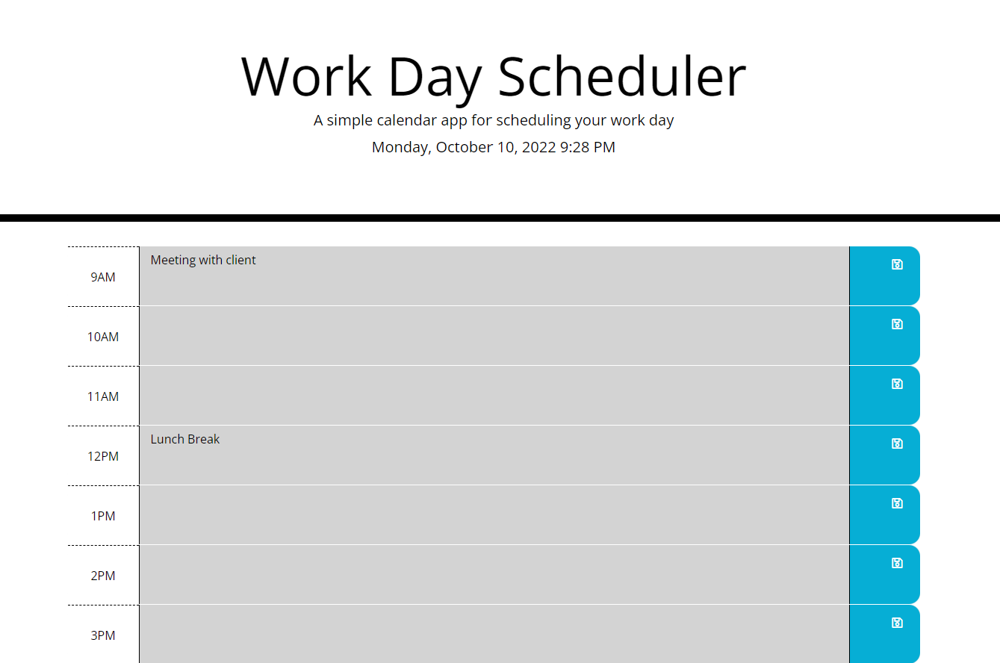

# Personal Portfolio

## Description

This application helps user to create a work day schedular.

I wanted to create an application which helps users create events during their work day. Users are able to save the events created in their calender and reflects them even after the webpage is refreshed. 

## Table of Contents (Optional)

If your README is long, add a table of contents to make it easy for users to find what they need.

- [Installation](#installation)
- [Demo](#Demo)
- [Usage](#usage)
- [Credits](#credits)
- [License](#license)
- [Features](#Features)
- [How to Contribute](#How_to_Contribute)

## Installation

There are not need to install anything. The webpage is going to be web hosted.

## Demo

[Click here to view the project](https://dancingsandwich.github.io/PasswordGenerator/)

## Usage

Click on any of these links or images to view the projects and get in touch. 

## Credits

TBD

## License

MIT License

Copyright (c) [2022] [Sanket Panchal]

Permission is hereby granted, free of charge, to any person obtaining a copy
of this software and associated documentation files (the "Software"), to deal
in the Software without restriction, including without limitation the rights
to use, copy, modify, merge, publish, distribute, sublicense, and/or sell
copies of the Software, and to permit persons to whom the Software is
furnished to do so, subject to the following conditions:

The above copyright notice and this permission notice shall be included in all
copies or substantial portions of the Software.

THE SOFTWARE IS PROVIDED "AS IS", WITHOUT WARRANTY OF ANY KIND, EXPRESS OR
IMPLIED, INCLUDING BUT NOT LIMITED TO THE WARRANTIES OF MERCHANTABILITY,
FITNESS FOR A PARTICULAR PURPOSE AND NONINFRINGEMENT. IN NO EVENT SHALL THE
AUTHORS OR COPYRIGHT HOLDERS BE LIABLE FOR ANY CLAIM, DAMAGES OR OTHER
LIABILITY, WHETHER IN AN ACTION OF CONTRACT, TORT OR OTHERWISE, ARISING FROM,
OUT OF OR IN CONNECTION WITH THE SOFTWARE OR THE USE OR OTHER DEALINGS IN THE
SOFTWARE.

---

## Features

- Generates hard to guess randomly generated passwords
- Ability to chose length
- Options to chose upper and lower cases
- Selection of numbers and special characters in the password.

## How to Contribute

Create a seperate feature branch and create pull request. 